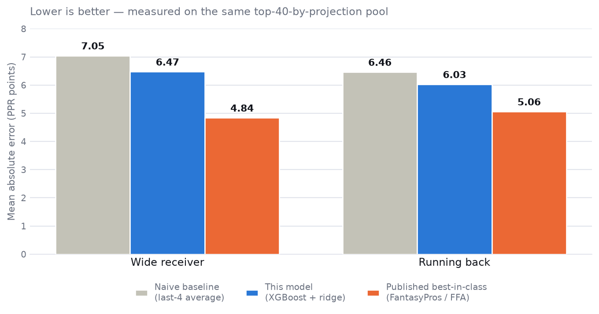
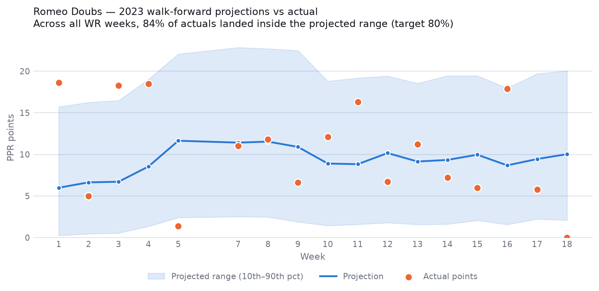

# NFL Fantasy Points Predictor

## Project Report

September 2026

Jaxon Scott

---

## 1.0 Introduction

This document describes a system that predicts weekly fantasy football points for NFL wide
receivers and running backs. It covers six versions, from a simple rolling average to a
model that combines two algorithms and reports a prediction range.

The project had two goals: to gain practical machine learning experience, and to learn to
direct an AI coding assistant on work where mistakes are easy to make and hard to notice.
Most of the code was written with Claude Code and reviewed manually. Section 5.0 covers
that process.

The measured result is that the model is more accurate than a simple average, and less
accurate than the professional services it was compared against. Section 3.1 explains why
the first accuracy figure the project produced was wrong, and how that was found.

Data comes from nflverse, a free public source of NFL statistics. The project ran from
September 10 to September 21, 2026.

Appendix A lists the commands to run the app and reproduce every figure in this report.

## 2.0 Evolution of the Model

### 2.1 Summary Table

| Version | Key features | Main issues |
|---|---|---|
| v1 Baseline | Average of a player's last 4 games | No model, only a reference point |
| v2 First model | XGBoost, rolling usage and efficiency features, betting lines | Beat the baseline only for high-volume players |
| v3 Two positions | Running backs added, separate model per position | Shared defence feature mixed the positions together |
| v4 Measurement | Evaluation tools, standard player pool, multi-season testing | I found that counting every player had overstated accuracy by about 30% |
| v5 Opportunity features | Expected points, snap share, target share | Injury features added and removed, no effect |
| v6 Ensemble and ranges | XGBoost plus ridge regression, prediction ranges | Payload of accuracy gain is small, gap to professionals remains |

Table 1: Summary of the six versions.

### 2.2 Detailed Notes

**v1 Baseline**

Intent: Establish a number to beat.

Key choices
- Predict each player at the average of his last four games.
- Verified by hand against one player's week 9 score.

Issues observed
- A rolling average ignores the opponent, injuries, and any change in a player's role.

**v2 First model**

Intent: Beat the rolling average using machine learning.

Key changes
- XGBoost, retrained once for every week of the season.
- Rolling features for targets, catches, carries, yards and touchdowns.
- Opponent strength and betting lines added.

What worked
- More accurate than the baseline for high-volume players.

Issues observed
- Less accurate than the baseline for low-volume players, who make up three quarters of
  the data. A fallback was added that used the baseline for those players.

**v3 Two positions**

Intent: Extend the system to running backs.

Key changes
- One model per position. The positions are never combined, because a carry means
  something different for a receiver than for a running back.
- Features added for running backs: touches, yards per carry, rushing first downs.

Issues observed
- The opponent-strength feature added up points allowed to all active positions at once.
  Adding running backs would have silently changed the receiver numbers. Fixed by
  calculating that feature separately for each position.

**v4 Measurement**

Intent: Find out whether the accuracy figures meant anything.

Key changes
- Evaluation tools that score any method on any group of players.
- Switched to the group professional studies use: the top 40 players per position per
  week, ranked by projection.
- Extended testing from one season to five.

What worked
- Produced the first accuracy figure comparable to an outside reference.
- I found that counting every player on a roster, rather than the top 40, had been
  lowering the reported error by about 30%. See section 3.1.

Issues observed
- Playoff games were inside the training data and inside the rolling averages. Removing
  them made the results slightly worse, which was correct.

**v5 Opportunity features**

Intent: Add the information the model was missing.

Key changes
- Expected fantasy points from nflverse, which measures what a player's opportunities were
  worth rather than what he scored.
- Snap share, target share, and share of the team's passing yards.

What worked
- The largest single accuracy gain of the project. Expected points became the strongest
  feature in the model.
- The model now beat the baseline for low-volume players as well, so the v2 fallback was
  removed.

Issues observed
- Injury features were built and measured, and made no difference. See section 3.4.

**v6 Ensemble and ranges**

Intent: Improve accuracy and report uncertainty.

Key changes
- Final prediction is the average of XGBoost and ridge regression.
- A second model predicts a range rather than a single number.

What worked
- Small accuracy gain from combining two models.
- Ranges are accurate to within two percentage points of their target.

Issues observed
- The remaining gap to professional services is mostly missing data, not modelling.

## 3.0 Thought Process Through Significant Changes

### 3.1 Choosing which players to count

Accuracy depends on which players are included. A team roster carries around 140 receivers
per week across the league, but most are bench players who score close to zero. They are
easy to predict, so including them makes any model look accurate.

I found this partway through the project, which had been reporting 4.49 MAE for several
weeks. Published accuracy studies score only the top 40 receivers per week, and measured
that way the same model scored 6.47. Nothing about the model had changed, only the group
of players being counted, and including the other hundred had been lowering the reported
error by about 30%.

I kept the worse figure, because it is the only one that can be compared to an outside
reference. Every number in this report uses the top 40 per position per week.

### 3.2 Expected points

Actual fantasy points are noisy because touchdowns are close to random in the short term. A
receiver who gets 11 targets and 140 air yards had a good week of opportunity even if he
scored 4 points.

nflverse publishes an expected points figure that measures the value of a player's
opportunities. Adding a rolling average of it produced the largest accuracy gain in the
project, and it became the single strongest feature. This matches the reasoning above:
opportunity is more stable week to week than scoring.

### 3.3 Choosing the final model

Three candidates were tested. A combination of XGBoost, ridge regression and a third model
that predicts the median scored the best MAE, at 6.43 for receivers against 6.47 for the
chosen combination.

The best-scoring option was rejected. A median prediction sits below the average when
scores are skewed, and fantasy scores are more skewed for better players. Checking one
real player showed the effect: the rejected model projected Puka Nacua at 18.4 points
where the chosen model said 22.7. The average bias was 0.84 points, but for a top receiver
it was around 4.4 points.

A projection service that undersells its best players is not useful, so the second-best
MAE was shipped.

### 3.4 Injury features, removed

Injury status seemed likely to help. The model had no idea whether a player was hurt.

The hypothesis was wrong for a specific reason. A player listed as Out does not appear in
the statistics at all. All 996 players listed Out in 2023 had no row of data. The model
never predicts them, so the error the feature was meant to catch cannot happen.

Two versions were built and measured. Neither changed accuracy by a meaningful amount.
Both were removed.

| | Before | Teammate counts | Weighted by opportunity |
|---|---|---|---|
| Wide receiver | 6.514 | 6.519 | 6.511 |
| Running back | 6.073 | 6.109 | 6.088 |

Table 2: Injury feature results, showing no useful change.

### 3.5 Prediction ranges

A single number gives no sense of confidence. The first attempt added and subtracted the
model's average error, which gave every player in a group the same range.

The second attempt trains a model to predict the 10th and 90th percentile directly, so the
range is calculated per player and widens for unpredictable ones. Measured coverage was 78%
for receivers and 79% for running backs against a target of 80%.

The first method was also too narrow. It produced ranges around 13.8 points wide where 19
points are needed for 80% coverage, so it understated uncertainty.

## 4.0 Results

All figures use the top 40 players per position per week, across the 2021 to 2025 seasons.
This covers 180 weeks of testing and 21,600 player-weeks. Lower MAE is better.

| Method | WR MAE | RB MAE |
|---|---|---|
| Average of last 4 games | 7.047 | 6.464 |
| Expected points average | 6.775 | 6.251 |
| First model, usage features only | 6.578 | 6.168 |
| Plus opportunity features | 6.514 | 6.073 |
| Final: XGBoost plus ridge | 6.474 | 6.029 |
| Professional services | 4.84 - 4.94 | 5.06 - 5.20 |

Table 3: Accuracy by version, all measured the same way.

Accuracy by season, for the final model:

| | 2021 | 2022 | 2023 | 2024 | 2025 |
|---|---|---|---|---|---|
| Wide receiver | 6.41 | 6.35 | 6.76 | 6.50 | 6.35 |
| Running back | 6.33 | 6.15 | 5.76 | 5.82 | 6.09 |

Table 4: Season by season results. The spread is small, so the gap to the professional
services is consistent rather than a result of one bad year.

One caution. A single season can point the wrong way. Adding the opportunity features made
receivers worse across 2023 alone, from 6.760 to 6.806, and better across all five seasons,
from 6.578 to 6.514. Eighteen weeks is too small a sample to judge a change on.

## 5.0 How the Project Was Built

The code was written with Claude Code. My work was deciding what the system had to prove
about itself and building the checks that prove it, because a model that is quietly wrong
still produces confident numbers. The measurement error in section 3.1 is the clearest
example: the code was doing exactly what it was told, and what it was told was wrong.

**An automatic check on every change.** A script runs after any edit to the model code. It
re-runs the accuracy measurement, compares against six fixed numbers, and stops work if any
of them move. It treats an unexplained improvement as a problem, not a success, because an
improvement usually means the model has been given information it should not have.

**Tests for the rules that keep the model honest.** 62 tests, running in about 11 seconds.
The important ones check that a prediction for a given week never uses data from that week,
that a player's rolling average never includes another player's games, and that playoff
games stay out of the regular season data.

These tests found a real fault. A check that compares the evaluation tools against the
training code had stopped working three versions earlier, and had been reporting a blank
result instead of an error. The automatic check above never caught it because it runs a
different part of the code.

**Recording what did not work.** The injury features in section 3.4 were measured and
removed rather than quietly kept. Section 3.3 describes rejecting the model that scored
best.

## 6.0 Limitations

- Covers wide receivers and running backs. Quarterbacks and tight ends would work the same
  way. Kickers and team defences need a different scoring calculation.
- The 2024 season is reserved as a final test and has not been used.
- Projections further than one week ahead reuse the current week's inputs, because the
  games in between have not been played. They show current form rather than a forecast.
- Scripts read data from a folder relative to where they are run, so they must be run from
  the project folder.
- The gap to professional services is mostly data. They use betting markets for individual
  players and injury reporting that is not publicly available.

---

## Appendix A: Running the Project

### The app

```bash
python -m venv .venv
.venv/Scripts/activate          # Windows. On Mac or Linux: source .venv/bin/activate
pip install -r requirements.txt
streamlit run app.py
```

Then open http://localhost:8501 in a browser. The Past Results screen works straight away,
using the sample of results in `docs/sample_results.csv`. The Upcoming Week and Player
Season screens need the NFL data downloaded first.

### Everything else

```bash
python src/data_load.py                            # download data, about 25 MB, once
python src/evaluate.py                             # accuracy tables for one season
python src/evaluate.py 2021 2022 2023 2024 2025    # the figures in Table 3
python src/upcoming.py                             # next week's projections

pytest                                             # 62 tests, about 11 seconds
pytest -m slow                                     # accuracy check against real data
```

Run everything from the project folder. Training takes a few minutes because the model is
refit once for each week of the season.

## Appendix B: File Layout

| Folder | Contents |
|---|---|
| `src/features_*.py` | Builds the inputs: usage, opportunity, opponent strength, betting lines |
| `src/validation.py` | Splits the data so a prediction only ever sees earlier games |
| `src/train.py` | Fits the models |
| `src/evaluate.py` | Measures accuracy and writes the results file |
| `src/comparators.py` | The methods being compared, including the final model |
| `gui/` and `app.py` | The Streamlit app |
| `tests/` | The 62 tests |
| `.claude/hooks/` | The automatic check described in section 5.0 |

## Appendix C: Figures



Figure 1: Accuracy against professional projections, measured on the same group of players.



Figure 2: One receiver's 2023 season. The line is the projection, the shaded band is the
predicted range, and the dots are what he actually scored.
